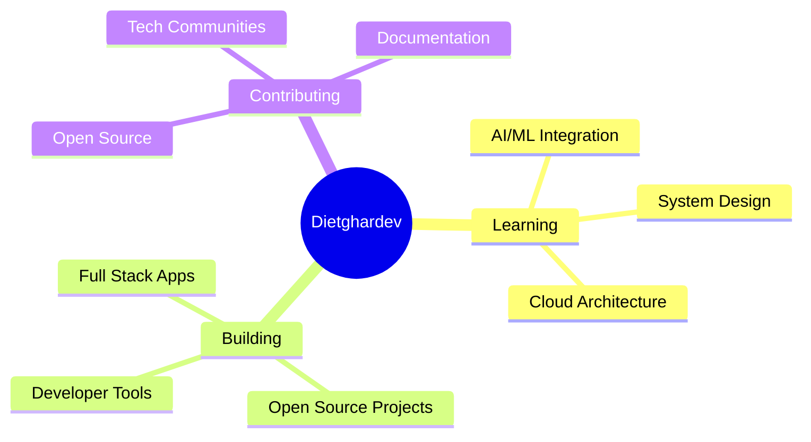

<h1 align="center">
  
</h1>

<p align="center">
  
</p>

<p align="center">
  <a href="https://github.com/dietghardev">
    
  </a>
  <a href="https://linkedin.com/in/dietghardev">
    
  </a>
  <a href="https://twitter.com/dietghardev">
    
  </a>
</p>

---

## 🚀 About Me

```typescript
const dietghardev = {
    pronouns: "He" | "Him",
    code: ["JavaScript", "TypeScript", "Python", "Java", "Go"],
    askMeAbout: ["web dev", "tech", "app dev", "software architecture"],
    technologies: {
        frontEnd: {
            js: ["React", "Next.js", "Vue", "Angular"],
            css: ["Tailwind", "Bootstrap", "Material-UI", "Styled-Components"]
        },
        backEnd: {
            js: ["Node", "Express", "Nest.js"],
            python: ["Django", "Flask", "FastAPI"],
            misc: ["GraphQL", "REST APIs"]
        },
        databases: ["MongoDB", "PostgreSQL", "MySQL", "Redis", "Firebase"],
        devOps: ["Docker", "Kubernetes", "AWS", "GCP", "CI/CD", "Nginx"],
        mobile: ["React Native", "Flutter"],
        tools: ["Git", "VS Code", "Postman", "Figma"]
    },
    currentFocus: "Building scalable applications and exploring AI/ML",
    funFact: "I debug with console.log() and I'm not ashamed! 😄"
};
```

---

## 🛠️ Tech Stack

### Languages


### Frontend


### Backend


### Databases


### DevOps & Cloud


---

## 📊 GitHub Stats & Activity

<div align="center">

```text
🏆 Total Contributions: 2,479+
⭐ Total Stars: Growing
🔥 Current Streak: Active
📦 Total Repositories: Check out my work!
```

<a href="https://github.com/dietghardev">
  
  
</a>

</div>

---

## 🐍 Contribution Snake

<picture>
  <source media="(prefers-color-scheme: dark)" srcset="https://raw.githubusercontent.com/dietghardev/dietghardev/output/github-contribution-grid-snake-dark.svg">
  <source media="(prefers-color-scheme: light)" srcset="https://raw.githubusercontent.com/dietghardev/dietghardev/output/github-contribution-grid-snake.svg">
  
</picture>

---

## 📈 Recent Activity

<!--START_SECTION:activity-->
<!--END_SECTION:activity-->

---

## 💡 Random Dev Quote

<p align="center">
  
</p>

---

## 🎯 Current Focus



---

## 📫 Let's Connect!

<p align="center">
  💼 Open to collaborating on interesting projects and innovative ideas.<br/>
  📧 Reach out to me at: <a href="mailto:dietghardev@example.com">dietghardev@example.com</a>
</p>

<p align="center">
  <a href="https://github.com/dietghardev">
    
  </a>
  <a href="https://github.com/dietghardev">
    
  </a>
</p>

---

<p align="center">
  
</p>

<p align="center">
  Made with ❤️ and lots of ☕
</p>
