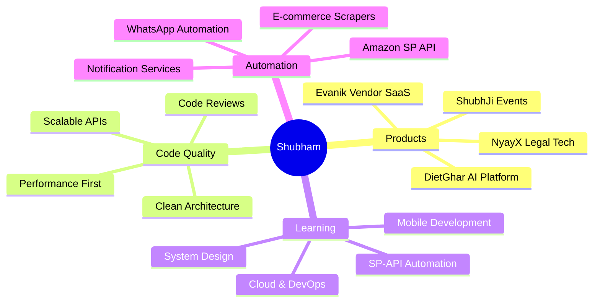

<div align="center">
  
</div>

<h1 align="center">
  
</h1>

<p align="center">
  
  
</p>

<div align="center">

```ascii
╔═══════════════════════════════════════════════════════════════════╗
║  "Code is like humor. When you have to explain it, it's bad."    ║
║                         - Cory House                              ║
╚═══════════════════════════════════════════════════════════════════╝
```

</div>

<p align="center">
  <a href="https://shubhamkansal.com">
    
  </a>
  <a href="https://github.com/dietghardev">
    
  </a>
  <a href="https://linkedin.com/in/shubhamkansal">
    
  </a>
  <a href="mailto:hello@shubhamkansal.com">
    
  </a>
</p>

---

## 🚀 About Me

```typescript
class Developer {
    name: string = "Shubham Kansal";
    role: string = "Full Stack Developer & DevOps Engineer | Founder";
    location: string = "India 🇮🇳";
    site: string = "shubhamkansal.com";

    products = {
        dietghar:  "AI-powered healthtech platform — dietghar.com",
        evanik:    "Multi-vendor e-commerce & seller SaaS",
        nyayX:     "Legal tech platform on AWS ECS with multi-tenant RLS",
        shubhJi:   "Wedding & event management platform",
    };

    code: string[] = ["JavaScript", "TypeScript", "Python"];

    technologies = {
        frontEnd:  ["React", "Next.js", "React Native", "Tailwind CSS"],
        backEnd:   ["Node.js", "Express.js", "NestJS", "Socket.io"],
        databases: ["MongoDB", "PostgreSQL", "Redis", "Firebase"],
        devOps:    ["Docker", "AWS ECS", "GitHub Actions", "Terraform", "Nginx"],
        tools:     ["Git", "VS Code", "Postman", "Figma"]
    };

    currentFocus = "Scaling DietGhar 2.0 & SP-API automation platform";
    lifePhilosophy = "Ship fast. Learn faster. Repeat 🔄";
}
```

### 🎮 Quick Facts

- 🔭 Currently building **DietGhar 2.0, Evanik Vendor SaaS & NyayX**
- 🌱 Deep in **AWS ECS, microservices, SP-API automation & cloud cost optimisation**
- 💼 Founder of **2 tech products** with **150+ repositories**
- 💬 Ask me about **Next.js, Node.js, PostgreSQL, DevOps or SP-API**
- ⚡ Fun fact: **Cut a client's AWS bill 40% in a single sprint. Cloud waste is real.**
- 🎯 2026 Goals: **Launch DietGhar 2.0 & hit 10,000+ vendors on Evanik**

---

## 🛠️ Tech Arsenal

<div align="center">

### 💻 Languages


### 🎨 Frontend


### ⚙️ Backend


### 🗄️ Databases


### ☁️ DevOps & Cloud


### 🧪 Tools


</div>

---

## 📊 GitHub Stats & Activity

<div align="center">


</div>

<div align="center">


</div>

<div align="center">

### 🎯 By the Numbers

```text
╔═══════════════════════════════════════════════════════════╗
║  🏆  Total Contributions      8,505+                      ║
║  📦  Total Repositories       150+                        ║
║  🏢  Organizations            2 (dietghar01, ZevnixAi)    ║
║  🔥  2026 Commits             346+ (June alone)           ║
║  🚀  Products Shipped         4 (DietGhar, Evanik,        ║
║                                  NyayX, ShubhJi)          ║
║  ⚡  SP-API SKUs Synced       50,000+                     ║
║  💰  Client AWS Bill Cut      40% in one sprint           ║
║  ☕  Coffee Consumed          Infinite Loop               ║
╚═══════════════════════════════════════════════════════════╝
```

### 💪 What I'm Currently Building

<table>
<tr>
<td width="50%" valign="top">

#### 🚀 Active Products
- **DietGhar 2.0** — AI meal planning & diet tracking
- **Evanik Vendor SaaS** — Multi-vendor seller platform
- **NyayX** — Court case tracking & legal tech
- **ShubhJi** — Wedding & event management

</td>
<td width="50%" valign="top">

#### 📚 Currently Focused On
- SP-API automation & marketplace sync
- AWS ECS cost optimisation
- Microservices & event-driven architecture
- React Native performance
- WhatsApp Cloud API automation

</td>
</tr>
</table>

</div>

---

## 🐍 Contribution Snake

<div align="center">

<picture>
  <source media="(prefers-color-scheme: dark)" srcset="https://raw.githubusercontent.com/dietghardev/dietghardev/output/github-contribution-grid-snake-dark.svg">
  <source media="(prefers-color-scheme: light)" srcset="https://raw.githubusercontent.com/dietghardev/dietghardev/output/github-contribution-grid-snake.svg">
  
</picture>

</div>

---

## 🎯 My Development Philosophy

<div align="center">



</div>

---

## 💡 Random Dev Quote

<div align="center">


</div>

---

## 🏆 Milestones

<div align="center">

| Achievement | Status | Details |
|------------|--------|---------|
| 🌟 First Repository | ✅ Complete | Shipped! |
| 💯 100 Contributions | ✅ Complete | 8,505+ total |
| 🔥 Consistent Coder | ✅ Complete | 346+ commits in June 2026 alone |
| 📦 100+ Repositories | ✅ Complete | 150+ repos across 2 orgs |
| 🏢 Founded 2 Orgs | ✅ Complete | dietghar01 & ZevnixAi-Applications |
| 🚀 4 Products Shipped | ✅ Complete | DietGhar, Evanik, NyayX, ShubhJi |
| ⚡ 50k+ SKUs Synced | ✅ Complete | SP-API platform, 24h → <15min |
| 👥 100 Followers | 🎯 Target | Growing... |

</div>

---

## 📈 Weekly Development Breakdown

```text
TypeScript   ████████████████░░░░  70%
JavaScript   █████████████░░░░░░░  60%
Python       ██████░░░░░░░░░░░░░░  25%
CSS/Tailwind █████████░░░░░░░░░░░  40%
Shell/Config ████░░░░░░░░░░░░░░░░  15%
```

---

## 📫 Let's Connect & Collaborate!

<div align="center">

### 💼 Open to exciting projects and collaborations

<p>
  <a href="https://shubhamkansal.com">
    
  </a>
</p>
<p>
  <a href="mailto:hello@shubhamkansal.com">
    
  </a>
</p>
<p>
  <a href="https://linkedin.com/in/shubhamkansal">
    
  </a>
</p>
<p>
  <a href="https://github.com/dietghardev">
    
  </a>
</p>

### 🎯 Let's Build Something Amazing Together!

```typescript
const collaborate = async () => {
    const expertise = ["Full Stack", "DevOps", "SaaS", "E-commerce", "Legal Tech", "Health Tech"];

    if (yourIdea.needsExpert(...expertise)) {
        await visit("shubhamkansal.com/contact");
        return "Let's build something amazing! 🚀";
    }
};
```

</div>

---

<div align="center">

### 🌟 "First, solve the problem. Then, write the code." - John Johnson

</div>

---

<div align="center">
  
</div>

<div align="center">

**Made with ❤️, ☕, and countless hours of debugging**


</div>
