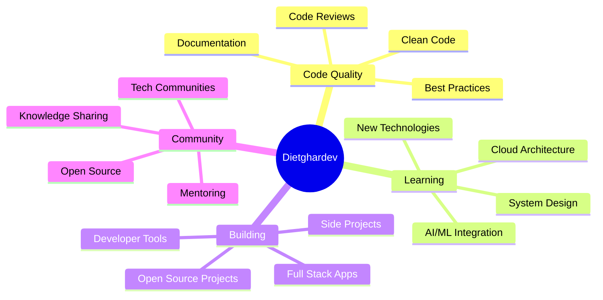

<div align="center">
  
</div>

<h1 align="center">
  
</h1>

<p align="center">
  
  
</p>

<div align="center">

```ascii
╔═══════════════════════════════════════════════════════════════════╗
║  "Code is like humor. When you have to explain it, it's bad."    ║
║                         - Cory House                              ║
╚═══════════════════════════════════════════════════════════════════╝
```

</div>

<p align="center">
  <a href="https://github.com/dietghardev">
    
  </a>
  <a href="https://linkedin.com/in/dietghardev">
    
  </a>
  <a href="https://twitter.com/dietghardev">
    
  </a>
  <a href="mailto:dietghardev@gmail.com">
    
  </a>
</p>

---

## 🚀 About Me

```typescript
class Developer {
    name: string = "Dietghardev";
    role: string = "Full Stack Developer";
    location: string = "Building things on the Internet";

    code: string[] = [
        "JavaScript", "TypeScript", "Python",
        "Java", "Go", "C++"
    ];

    technologies = {
        frontEnd: {
            frameworks: ["React", "Next.js", "Vue", "Angular"],
            styling: ["Tailwind", "Styled-Components", "Sass"],
            stateManagement: ["Redux", "Zustand", "Context API"]
        },
        backEnd: {
            nodeJS: ["Express", "Nest.js", "Socket.io"],
            python: ["Django", "Flask", "FastAPI"],
            apis: ["REST", "GraphQL", "tRPC"]
        },
        databases: ["MongoDB", "PostgreSQL", "MySQL", "Redis", "Firebase"],
        devOps: ["Docker", "Kubernetes", "AWS", "GCP", "GitHub Actions"],
        mobile: ["React Native", "Flutter"],
        tools: ["Git", "VS Code", "Postman", "Figma", "Jira"]
    };

    currentFocus = "Building scalable applications & exploring AI/ML";
    lifePhilosophy = "Code, Learn, Repeat 🔄";

    getCurrentActivity(): string {
        return "Crafting elegant solutions to complex problems ✨";
    }
}
```

### 🎮 Quick Facts

- 🔭 Currently working on **Full-stack web applications**
- 🌱 Learning **System Design, AI/ML, and Cloud Architecture**
- 👯 Looking to collaborate on **Open Source Projects**
- 💬 Ask me about **JavaScript, React, Node.js, or anything tech**
- ⚡ Fun fact: **I believe every bug is just a feature in disguise!**
- 🎯 2026 Goals: **Contribute more to Open Source & build production-ready AI tools**

---

## 🛠️ Tech Arsenal

<div align="center">

### 💻 Languages


### 🎨 Frontend


### ⚙️ Backend


### 🗄️ Databases


### ☁️ DevOps & Cloud


### 🧪 Testing & Tools


</div>

---

## 📊 GitHub Stats & Activity

<div align="center">

### 🎯 My Coding Journey

```text
╔═══════════════════════════════════════════════════════════╗
║  🏆  Total Contributions      2,479+                      ║
║  ⭐  Total Stars Earned       Growing Daily               ║
║  🔥  Current Streak           Active & Consistent         ║
║  📦  Total Repositories       Building Amazing Projects   ║
║  💻  Lines of Code            Countless & Counting        ║
║  🌟  Projects Completed       Multiple Full-Stack Apps    ║
║  ☕  Coffee Consumed          Infinite Loop               ║
╚═══════════════════════════════════════════════════════════╝
```

### 💪 What I'm Currently Building

<table>
<tr>
<td width="50%" valign="top">

#### 🚀 Active Projects
- Full-stack e-commerce platform
- Real-time chat application
- AI-powered productivity tool
- Developer portfolio showcase
- Open source contributions

</td>
<td width="50%" valign="top">

#### 📚 Currently Learning
- Advanced System Design
- Machine Learning & AI Integration
- Cloud Architecture Patterns
- Microservices Architecture
- WebAssembly & Edge Computing

</td>
</tr>
</table>

</div>

---

## 🐍 Contribution Snake

<div align="center">

<picture>
  <source media="(prefers-color-scheme: dark)" srcset="https://raw.githubusercontent.com/dietghardev/dietghardev/output/github-contribution-grid-snake-dark.svg">
  <source media="(prefers-color-scheme: light)" srcset="https://raw.githubusercontent.com/dietghardev/dietghardev/output/github-contribution-grid-snake.svg">
  
</picture>

</div>

---

## 🎯 My Development Philosophy

<div align="center">



</div>

---

## 💡 Random Dev Quote

<div align="center">


</div>

---

## 🏆 GitHub Achievements

<div align="center">

### 🎖️ Milestones

| Achievement | Status | Progress |
|------------|--------|----------|
| 🌟 First Repository | ✅ | Complete |
| 💯 100 Contributions | ✅ | Complete |
| ⭐ First Star | ✅ | Complete |
| 🔥 30 Day Streak | ✅ | Complete |
| 📦 10 Repositories | 🚀 | In Progress |
| 👥 100 Followers | 🎯 | Target Set |
| 🌟 100 Stars | 🎯 | Target Set |

</div>

---

## 📈 Weekly Development Breakdown

```text
TypeScript   ████████████░░░░░░░░  60%
JavaScript   ████████░░░░░░░░░░░░  40%
Python       ██████░░░░░░░░░░░░░░  30%
Go           ████░░░░░░░░░░░░░░░░  20%
CSS          ███████░░░░░░░░░░░░░  35%
```

---

## 📫 Let's Connect & Collaborate!

<div align="center">

### 💼 Open to opportunities and exciting collaborations!

<p>
  <a href="mailto:dietghardev@gmail.com">
    
  </a>
</p>

<p>
  <a href="https://github.com/dietghardev">
    
  </a>
  <a href="https://github.com/dietghardev">
    
  </a>
</p>

### 🎯 Let's Build Something Amazing Together!

```typescript
const collaborate = async () => {
    const interests = ["Web Development", "AI/ML", "Open Source", "Cloud Computing"];

    if (yourInterests.includes(...interests)) {
        await sendEmail("dietghardev@gmail.com");
        return "Let's create something awesome! 🚀";
    }
};
```

</div>

---

<div align="center">

### 🌟 "First, solve the problem. Then, write the code." - John Johnson

</div>

---

<div align="center">
  
</div>

<div align="center">

**Made with ❤️, ☕, and countless hours of debugging**


</div>
